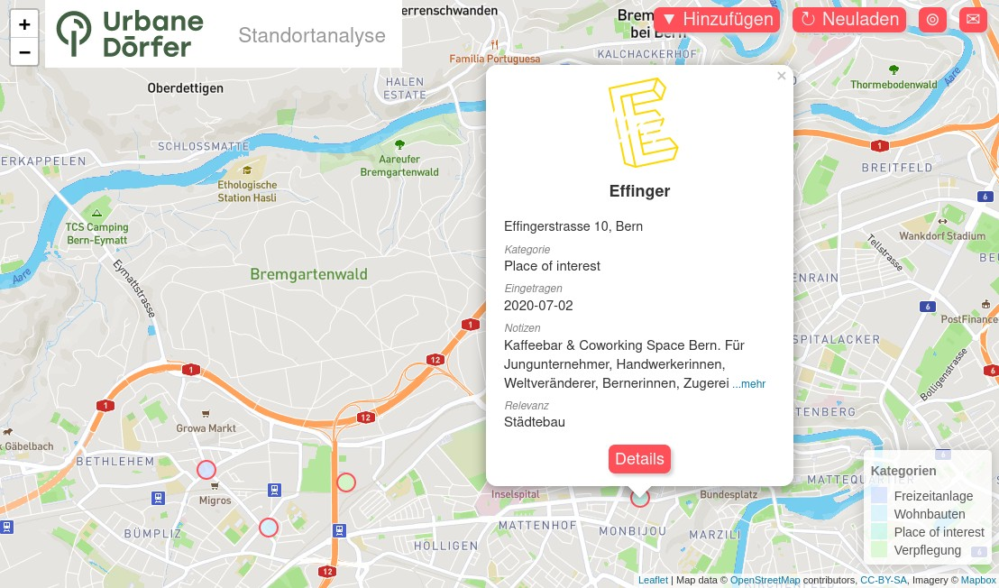

# Standortanalyse

This is a web based visualization of location data in an Airtable, developed by @loleg as part of the [Urbane Dörfer](https://www.urbanedoerfer.ch/) project.

The underlying project can be used to publish any spreadsheet published on Airtable, provided it has the (not yet configurable) columns _Name, Adresse, Lat, Lon, Kategorie_ (for the legend), _Notizen_ (free text), and _Bilder_ (image attachments).



Points on the map for each row along with a details popup on tap are shown. Right clicking anywhere on the map shows the current latitude and longitude. A legend is automatically generated from the category field. A button, "Hinzufügen", links to an Airtable form where new data points can be added. The data is refreshed by tapping "Neuladen" and your current position can be shown with the target button.

### Components

* [Airtable](https://airtable.com) for super-spreadsheets
* [Flask](https://flask.palletsprojects.com/), a [Python](https://python.org) web framework
* [Flask-API](http://www.flaskapi.org/) to expose public data
* [Leaflet.js](https://leafletjs.com/reference-1.6.0.html) geodata mapping
* [OpenStreetMap](https://osm.ch) via [Mapbox](https://mapbox.com/) as map base
* [Mustache](https://github.com/janl/mustache.js/) UI templating
* [Zepto](https://zeptojs.com/) UI tooling
* [Gunicorn](https://gunicorn.org/) web server support
* [Heroku](https://heroku.com) deployment support

### Project structure

| Location                |  Content                             |
|-------------------------|--------------------------------------|
| `/data`                 | Sample data structure                |
| `/static`               | Frontend resources                   |
| `/templates`            | Web templates                        |
| `/app.py`               | Flask API (`/api`)                   |

## Configuration

The following environment keys can be used to configure this project:

- `MAPBOX_KEY` get an access token [here](https://docs.mapbox.com/api/#access-tokens-and-token-scopes) or [here](view-source:https://leafletjs.com/examples/choropleth/example.html) for the base layer
- `AIRTABLE_BASE`, `AIRTABLE_TABLE` and `AIRTABLE_KEY` from the [Airtable API](https://airtable.com/api)
- `AIRTABLE_FORM` (optional) is the URL of the shared add (Form) view
- `AIRTABLE_LINK` (optional) is the URL of the shared detail (Gallery) view
- `POPUP_FIELDS` (optional) are a comma-delimited list of columns which are shown in the detail pop-up
- `SORT_KEY` (optional) to indicate which column to sort on

These can be added using Heroku's add project or Settings interface:

[](https://heroku.com/deploy?template=https://github.com/loleg/standortanalyse)

## Installation

First, clone this repository and make sure to set up the following dependencies:

- [X] [Python 3](https://python.org)
- [X] [Poetry](https://python-poetry.org/docs/)
- [X] [Heroku CLI](https://devcenter.heroku.com/articles/heroku-cli) (optional)

Setup a virtual environment, install dependencies, and activate it using Poetry:

```
$ poetry shell
$ poetry install
```

Create a file called `.flaskenv` in the root folder and add development settings and required keys from the Configuration section above - for example:

```
POPUP_FIELDS=Kategorie,Eingetragen,Notizen,Relevanz
SORT_KEY=Kategorie

AIRTABLE_BASE=...
AIRTABLE_KEY=...
AIRTABLE_TABLE=Standorte
AIRTABLE_LINK=https://airtable.com/shr...
AIRTABLE_FORM=https://airtable.com/shr...

MAPBOX_KEY=pk...

# When not in production:
FLASK_ENV=development
FLASK_DEBUG=true
```

Now start the development server:

```
$ flask run
```

- The API will be served from http://localhost:5000/items/
- The frontend will be served from http://127.0.0.1:5000/

### Dependency management

We are using poetry (and GitHub bots) to keep this project up to date. To check if you have the latest versions of upstream libraries, run:

`poetry update`

Heroku's buildpack currently does not support loading Python dependencies from poetry automatically. [We're working on it](https://github.com/heroku/heroku-buildpack-python/issues/796#issuecomment-611198469) ... in the meantime, please remember to run this command after upgrading dependencies:

`poetry export -f requirements.txt > requirements.txt`
